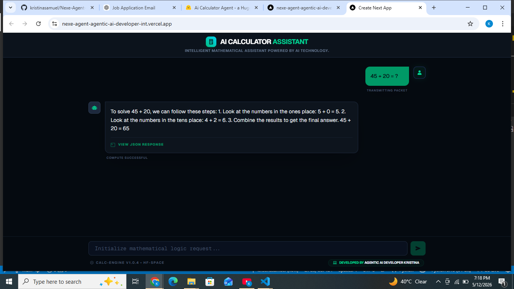

# AI Calculator Agent 🤖

Agentic AI Calculator built to handle complex mathematical operations with memory and structured output.

## 🚀 Live Demo
Check out the live application here: [https://nexe-agent-agentic-ai-developer-int.vercel.app/](https://nexe-agent-agentic-ai-developer-int.vercel.app/)

## 🎯 Main Objective
The primary goal of this project is to demonstrate advanced agentic capabilities, including:
- **Math Operations**: Solving multi-step mathematical problems.
- **Memory**: Maintaining session state and conversation history using SQLite.
- **Structured Output**: Providing clean, technical logic and refined answers.

## 🛠️ Tech Stack
### **Frontend**
- **Framework**: Next.js 16 (App Router)
- **Language**: TypeScript
- **Styling**: Tailwind CSS 4
- **Icons**: React Icons (Io5, Fa, Ri)

### **Backend**
- **Framework**: FastAPI (Python)
- **Agent Orchestration**: OpenAI SDK / Runner Logic
- **Memory Management**: SQLite Session Storage
- **Package Manager**: UV

## ✨ Key Features
- **Intelligent Reasoning**: Uses agentic logic to solve calculations rather than simple eval.
- **Conversation Memory**: Remembers previous context for follow-up questions.
- **Clean UI/UX**: Dark-themed, responsive interface with a futuristic "Calc-Engine" aesthetic.
- **Technical Logic View**: Option to view the underlying reasoning for each calculation.

## 🚦 Getting Started
1. **Clone the repository**
2. **Backend Setup**:
   - Navigate to `backend/`
   - Install dependencies using `uv`
   - Run the server: `python main.py`
3. **Frontend Setup**:
   - Navigate to `frontend/`
   - Install dependencies: `npm install`
   - Run the app: `npm run dev`

---
Developed by **Agentic AI Developer Kristina**
