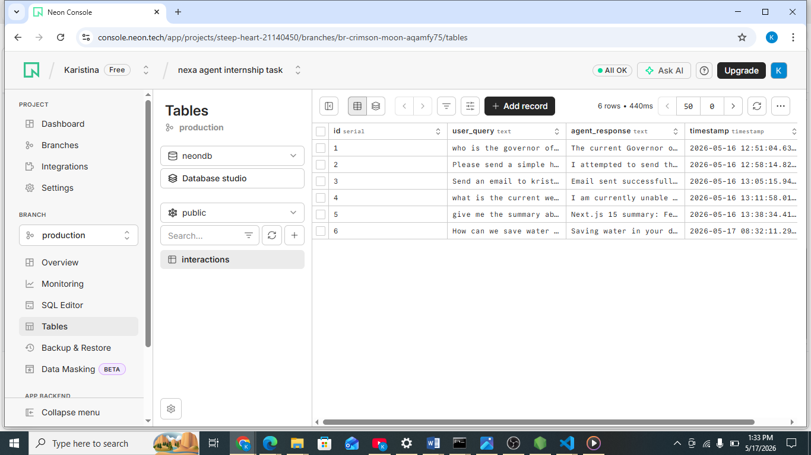

# Multi-Tool AI Agent 🤖

Advanced Agentic Assistant built to handle real-time web research, persistent database storage, and automated email communication.

## 🎯 Main Objective
The primary goal of this project is to demonstrate advanced agentic capabilities through multi-tool integration:
- **Web Search**: Fetching real-time information and current events using Tavily.
- **Save to DB**: Automatically logging every interaction into a Neon PostgreSQL database for persistent history.
- **Send Email**: Delivering professional emails via SMTP (Gmail) directly from the agent.

## 🛠️ Tech Stack
### **Frontend**
- **Framework**: Next.js (App Router)
- **Language**: TypeScript
- **Styling**: Tailwind CSS 
- **Database**: Neon

### **Backend**
- **Framework**: FastAPI (Python)
- **Agent Orchestration**: `openai-agents` / OpenAIChatCompletionsModel
- **Tools**: Tavily Search, PostgreSQL (psycopg2), SMTP
- **Package Manager**: UV 

## ✨ Key Features
- **Intelligent Research**: Uses agentic logic to browse the web and synthesize answers rather than simple keyword matching.
- **Automatic Persistence**: Every query and response is instantly saved to the database 
- **Multi-Service Integration**: Seamlessly switches between searching, saving, and emailing based on user intent.
- **Clean UI/UX**: Professional chat interface designed for high-signal technical interactions.
---

Developed by **Agentic AI Developer Kristina**
